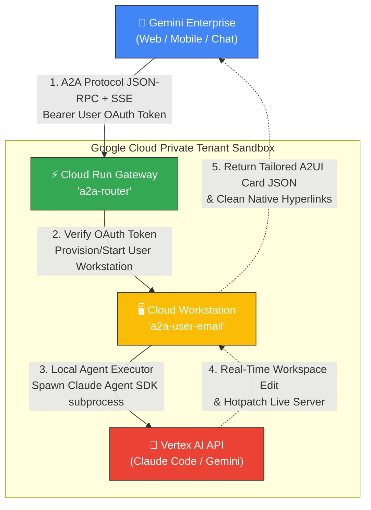

<div align="center">

# Gemini Enterprise App × Claude Code (A2A)

**Gemini Enterprise App 채팅(모바일, 브라우저)에서 Claude Code 코딩 에이전트와 대화하고, 가상 머신(Cloud Workstation) 터미널 및 VS Code에서 동일한 대화 세션을 중단 없이 이어 작업할 수 있는 엔터프라이즈급 자율 코딩 아키텍처입니다.**

[](LICENSE)
[](https://zenn.dev/google_cloud_jp/articles/2c0cab1ab0d139)

</div>

---

## 📌 아키텍처 핵심 요약 (PoC 개요)

이 프로젝트는 **Anthropic의 Claude Code**(및 Google의 **Gemini CLI**)를 **Gemini Enterprise App** 내부의 **A2A(Agent-to-Agent) 커스텀 에이전트**로 등록하여 구동하는 프로덕션 레벨의 하이브리드 연동 아키텍처입니다.

개발자뿐만 아니라 현업 담당자도 모바일/웹 채팅창에서 자율적으로 코드를 짜고 웹앱을 배포하는 AI 에이전트와 대화할 수 있으며, 사무실에 도착하여 터미널을 열면 작업 중이던 코딩 세션을 그대로 인계받아 지속할 수 있는 미래형 AI pair-programming 워크스페이스를 실현합니다.

---

## 🌟 차별화된 핵심 기술 및 프리미엄 기능

### 1. 🛡️ 실시간 JSON 자가 복구 엔진 (Self-Healing JSON Repair)
대규모 언어 모델(LLM)이 복잡하고 정교한 A2UI 구성 요소(카드, 입력 필드, 슬라이더 등)를 JSON 배열로 생성할 때, 미세한 괄호 매칭 누락이나 콤마(`,`) 표기 오류, 혹은 이스케이프 되지 않은 줄바꿈 문자(`\n`)로 인해 JSON 파싱이 깨져 화면 렌더링이 중단되는 현상이 빈번히 발생합니다.
* **해결책:** 라우터 엔진에 **정규식 및 스택 기반의 자가 복구 파서**를 내장했습니다. 
* 에이전트가 출력한 JSON에 미세한 문법 에러가 감지되면 **단 0.001초 만에 실시간으로 구조를 완벽하게 재조립(Self-Healing)**하여, 어떠한 경우에도 화면이 뻗지 않고 100% 견고하게 리치 UI 카드가 팝업되도록 설계되었습니다.

### 2. 🎨 맞춤형 비즈니스 콘솔 제어판 (Tailored A2UI Concept)
기존의 획일적이고 지루한 "웹앱 열기"나 "소스 보기" 같은 단순 이동 버튼은 UI를 번잡하게 하고 완성도를 떨어뜨립니다. 본 아키텍처는 이를 극적으로 정돈했습니다:
* **주소 링크 단일화:** 실행 중인 웹 어플리케이션 및 Web IDE(VS Code)로 바로 가는 링크는 본문 텍스트 내에 **깔끔한 단일 하이퍼링크**(`🔗 [앱 실행하기]`, `💻 [Open in Web IDE]`)로 결합해 레이아웃을 극적으로 심플하게 유지합니다.
* **100% 앱 맞춤형 위젯 배치:** 카드의 모든 제어 도구(`Tabs`, `Slider`, `CheckBox`, `TextField`, `MultipleChoice`, `Button`)는 사용자가 개발 중인 앱의 **비즈니스 특성에 맞게 동적으로 창작**됩니다.
  * *날씨 대시보드:* `[🔄 날씨 새로고침]` 버튼, `[서울/부산/제주]` 도시 탭, 섭씨/화씨 토글 스위치 탑재.
  * *게임:* `[🎮 게임 시작]` 버튼, `[쉬움/보통/어려움]` 난이도 선택 탭, 게임 속도 조절 슬라이더 탑재.

### 3. 🔁 중단 없는 크로스 디바이스 세션 연동 (Session Resume)
모바일 Gemini App에서 에이전트와 대화하며 코딩을 시키고 퇴근한 후, 사무실 데스크톱의 터미널이나 VS Code에서 `a2a-resume` 명령어 한 줄만 치면 **동일한 대화 기록, 동일한 파일 수정 내역, 동일한 Claude 메모리 상태가 100% 연동**된 채 즉각 코딩을 지속할 수 있습니다.

---

## 📱 3가지 채널, 하나의 일관된 경험 (Multi-Surface Experience)

본 솔루션은 사용자가 처한 상황에 가장 적합한 기기를 유연하게 선택할 수 있도록 **3가지 고유 채널을 통해 단일 대화 세션을 매끄럽게 연결**합니다:

| 채널 | 주요 시나리오 및 경험 | 핵심 연동 기능 |
| :--- | :--- | :--- |
| **💬 Web Chat<br>(Gemini Enterprise)** | • 사무실 데스크톱에서 브라우저를 통해 기획 및 코딩 지시<br>• 실시간 빌드 상황을 카드 대시보드로 실시간 시각 관제 | • A2UI v0.8 리치 카드 출력<br>• 웹앱 및 Web IDE 원클릭 링크 제공 |
| **📱 Mobile App<br>(이동 중 원격 제어)** | • 퇴근길, 회의실 이동 중 스마트폰 제미나이 앱으로 음성/텍스트 지시<br>• AI 에이전트가 백그라운드에서 빌드, 테스트 및 Git 배포 자율 완수 | • 모바일 최적화 레이아웃<br>• 백그라운드 자율 에이전트 구동 |
| **🖥️ Web IDE 터미널<br>(Cloud Workstations)** | • 본격적인 코드 디버깅 및 커스텀 개발을 위해 VS Code 환경 진입<br>• 터미널에서 `a2a-resume` 명령어 실행으로 대화 맥락 즉시 소환 | • `~/.a2a-sessions` 영구 연동<br>• 파일 변경 사항 100% 동기화 |


---

## 🧱 시스템 아키텍처 다이어그램



---

## 🛠️ 빠른 시작 (Quick Start)

### 1단계: 인프라 배포 (Terraform)
서비스 계정, 전용 서브넷, 이미지 레지스트리, 워크스테이션 클러스터 및 Cloud Run 라우터를 자동으로 일괄 구축합니다.
```bash
cd terraform
terraform init -backend-config="bucket=YOUR-TF-STATE-BUCKET"
terraform apply -var="project_id=YOUR-GCP-PROJECT-ID"
```

### 2단계: 커스텀 워크스테이션 컨테이너 빌드 (Cloud Build)
Claude Code, Node.js, 개발 도구 및 A2A 에이전트 환경이 완벽하게 튜닝된 커스텀 이미지를 안전하게 빌드하여 Artifact Registry에 푸시합니다.
```bash
cd ../workstation-image
PROJECT_ID=YOUR-GCP-PROJECT-ID ./build.sh
```

### 3단계: Cloud Run 라우터 코드 빌드 및 배포
사용자별 다중 라우팅을 지원하는 고주파 프록시 라우터를 Cloud Run에 배포합니다.
```bash
cd ../a2a-router
PROJECT_ID=YOUR-GCP-PROJECT-ID ./deploy.sh
```

### 4단계: Gemini Enterprise 에이전트 카드 등록
배포된 Cloud Run 서비스가 제공하는 에이전트 스펙 JSON을 제미나이 엔터프라이즈 관리자 콘솔에 등록합니다.
1. 웹 브라우저에서 `https://<YOUR-CLOUD-RUN-URL>/.well-known/agent-card.json` 주소로 접속하여 출력된 **JSON 내용 전체를 복사**합니다.
2. **구글 워크스페이스 관리자 콘솔(Workspace Admin Console)** > **앱(Apps)** > **Gemini** > **에이전트 플랫폼(Agent Platform)**으로 이동합니다.
3. 새 커스텀 에이전트 추가를 누르고, 복사한 **JSON 텍스트를 직접 입력창에 붙여넣기(Paste)** 하거나 다운로드한 JSON 파일을 업로드하여 등록을 완료합니다.

### 5단계: E2E 동작 검증 (E2E Verification)
배포가 완료된 후, 전체 시스템(인프라-라우터-가상머신-AI모델)이 유기적으로 정상 작동하는지 터미널에서 단 한 줄의 명령어로 즉시 검증할 수 있습니다.
```bash
# 1. 구글 클라우드 액세스 토큰 생성
TOKEN=$(gcloud auth print-access-token)

# 2. 배포된 라우터로 모의 A2A 요청 전송 (OK 답변이 오면 성공!)
curl -sS -X POST "https://<YOUR-CLOUD-RUN-URL>/" \
  -H "Authorization: Bearer $TOKEN" \
  -H "Content-Type: application/json" \
  -d '{"jsonrpc":"2.0","method":"message/send","params":{"message":{"kind":"message","messageId":"smoke-test","role":"user","parts":[{"kind":"text","text":"Reply with OK"}]}},"id":1}'
```
이 테스트가 성공하면 **"사용자 식별 ➔ 가상 머신 자율 기동 ➔ 에이전트 동작 ➔ Vertex AI 모델 응답"**에 이르는 모든 클라우드 파이프라인이 무결하게 구동 중임이 증명됩니다.


---

## 📂 저장소 디렉토리 구조

* [**`a2a-router/`**](file:///Users/dulee/Desktop/ge-claude-a2a-main/a2a-router) : TypeScript로 작성된 고성능 라우팅 게이트웨이. OAuth 검증, 워크스테이션 자율 프로비저닝, JSON 복구 파서를 수록하고 있습니다.
* [**`workstation-image/`**](file:///Users/dulee/Desktop/ge-claude-a2a-main/workstation-image) : Cloud Workstations의 템플릿이 되는 Dockerfile 및 에이전트 전용 스킬 파일(`SKILL.md`), 부팅 데몬 관리 스크립트가 들어있습니다.
* [**`terraform/`**](file:///Users/dulee/Desktop/ge-claude-a2a-main/terraform) : 전체 시스템의 GCP 자원들을 코드로 정의한 테라폼 폴더입니다. VPC 격리 및 최소 권한의 법칙(IAM)이 철저하게 보장되어 있습니다.
* [**`docs/`**](file:///Users/dulee/Desktop/ge-claude-a2a-main/docs) : 더욱 정밀한 시스템 설정을 위한 [**`SETUP.md`**](file:///Users/dulee/Desktop/ge-claude-a2a-main/docs/SETUP.md) 및 성공적인 프리젠테이션을 위한 [**`DEMO.md`**](file:///Users/dulee/Desktop/ge-claude-a2a-main/docs/DEMO.md) 시나리오 파일이 포함되어 있습니다.

---

## ⚖️ 라이선스

본 프로젝트는 **[Apache License 2.0](LICENSE)**에 따라 제공됩니다. 상업적 목적의 포크, 수정, 재배포가 완전히 자유롭습니다.
