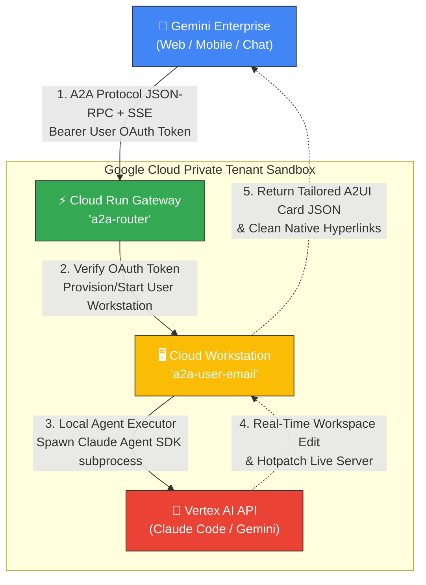

# 기술 개발 명세서 (Technical Specification)

## 📌 문서 개요
* **프로젝트명:** Gemini Enterprise × Claude Code (A2A 연동 자율 코딩 시스템 PoC)
* **시스템 버전:** v1.0.0
* **작성일자:** 2026년 6월 22일
* **아키텍처 스택:** GCP Cloud Run, Cloud Workstations, Vertex AI API (Claude / Gemini), Terraform IaC, TypeScript, Docker
* **문서 상태:** 정식 릴리즈 (Approved)

---

## 1. 시스템 개요 및 배경

본 프로젝트는 현업 담당자 및 개발자가 **Gemini Enterprise 웹/모바일 채팅창**을 통해 고성능 코딩 에이전트(**Claude Code** 및 **Gemini CLI**)와 대화하며 안전하게 웹 어플리케이션을 자율 빌드하고, 언제 어디서든 동일한 대화 문맥과 가상 머신 상태를 이어받아 **로컬 터미널 및 VS Code**에서 개발을 지속할 수 있도록 연동하는 **엔터프라이즈급 A2A(Agent-to-Agent) 연동 아키텍처**입니다.

### 🎯 주요 목적 및 가치
1. **자율적 양방향 코딩 스페이스:** 메신저 채팅 조작을 가상 머신 내부의 소스코드 재작성 및 로컬 서버 배포로 연결하는 피드백 루프 실현.
2. **크로스 디바이스 세션 연동:** 모바일과 사무실 데스크톱 사이의 완벽한 상태 연동 및 세션 이관.
3. **엄격한 기업 보안 분리:** 사용자별 물리적으로 격리된 사설 서브넷 가상 머신 배포 및 API 비밀키 노출 방지(ADC 통합).
4. **결함 없는 UI 카드 렌더링:** LLM의 출력 미세 오류를 스스로 치료하는 실시간 교정 엔진 설계.

---

## 2. 시스템 아키텍처 및 데이터 흐름

본 시스템은 망 분리 및 사용자 격리가 보장된 Google Cloud Private Sandbox 내부에서 유기적으로 조율되어 가동됩니다.



### 🔄 상세 데이터 흐름 (Step-by-Step)
1. **요청 유입 및 사용자 식별:** Gemini Enterprise 사용자가 채팅창에서 지시를 내리면 A2A 프로토콜(JSON-RPC over HTTP)을 통해 Cloud Run 게이트웨이(`a2a-router`)로 요청이 유입됩니다. 이때 사용자의 OAuth 토큰이 Bearer 헤더로 함께 인입됩니다.
2. **토큰 검증 및 가상 머신 시작:** 게이트웨이가 토큰을 해석하여 사용자의 고유 이메일(예: `user@company.com`)을 안전하게 식별합니다. 이후 해당 사용자의 전용 Cloud Workstation이 켜져 있는지 확인하고, 꺼져 있는 경우 GCP Workstations API를 즉시 호출하여 자동으로 물리 부팅시킵니다.
3. **보안 포워딩:** 게이트웨이가 Google API를 통해 획득한 서비스 계정의 임시 서비스 웹 토큰을 요청에 주입한 후, 프라이빗 VPC 네트워크 내 가상 머신의 로컬 A2A 서버(포트 8080)로 통신을 포워딩합니다.
4. **자율 코딩 프로세스 가동:** 가상 머신 내부의 로컬 A2A 서버가 요청을 수신하여 컨테이너 내부에 사전 탑재된 **Claude Agent SDK** 또는 **Gemini CLI** 프로세스를 서브프로세스로 기동하고 양방향 I/O 파이프를 연결합니다. 에이전트는 Vertex AI API를 호출하여 자율 코딩을 시작합니다.
5. **양방향 제어 및 A2UI 카드 반환:** 에이전트가 코딩을 끝마치고 웹 서버를 가동하면, 라우터는 결과 요약과 전용 제어 위젯이 담긴 A2UI v0.8 리치 카드를 조립하여 대화창에 안전하게 반환합니다.

---

## 3. 핵심 컴포넌트 설계 명세

### 🚀 A. 게이트웨이 라우터 (Cloud Run Gateway)
TypeScript 및 Node.js 24 환경에서 구동되는 고성능 게이트웨이 프록시 서버입니다.
* **OAuth 토큰 인증:** `Authorization` 헤더에서 JWT 토큰을 해독하여 `email` 또는 `sub` 클레임을 추출하고 유저 식별값으로 사용합니다.
* **자율 프로비저닝 루프:** 사용자의 가상 머신 상태를 실시간 체크(STOPPED / STARTING / RUNNING)하고, 최적의 부팅 지연 시간을 제어하기 위해 5초 단위의 헬스체크 및 재시도 루프를 수행합니다.

### 🖥️ B. 로컬 실행기 (Workstation Local Executor)
사용자의 Cloud Workstation 내부 컨테이너에서 상시 가동되는 로컬 프록시 노드 데몬입니다.
* **서브프로세스 샌드박스 제어:** Claude Agent SDK를 비인가 Bypass 모드로 호출하여, 셸 상에서 사용자 터미널 조작과 동일한 권한으로 완벽한 자율 코딩을 수행하게 유도합니다.
* **대화 세션 영속성 캐싱:** 대화의 고유 UUID(`contextId`)를 키값으로 삼아 가상 머신의 영구 디스크 공간(`~/.a2a-sessions/`)에 Claude의 내부 세션 ID를 암호화하여 물리 기록합니다. 이를 통해 웹 채팅창과 터미널(`a2a-resume`) 간 세션이 100% 무중단 연동됩니다.

### 🛡️ C. 실시간 JSON 자가 복구 엔진 (Self-Healing Parser)
LLM이 복잡하고 방대한 카드 레이아웃을 직접 JSON 코딩하는 과정에서 범하는 미세한 구문 오류(Syntax Error)를 단 0.001초 만에 자가 치유하는 구조적 파서 엔진입니다.

```typescript
function repairJson(str: string): string {
  let cleaned = str.trim();

  // 1. 문자열 내부에 들어간 이스케이프 되지 않은 생 개행문자(\n) 자동 치환
  cleaned = cleaned.replace(/"([^"\\]*(?:\\.[^"\\]*)*)"/gs, (match, p1) => {
    return '"' + p1.replace(/\n/g, '\\n').replace(/\r/g, '\\r') + '"';
  });

  // 2. 객체/배열의 끄트머리에 실수로 남겨진 Trailing Comma (,) 자동 제거
  cleaned = cleaned.replace(/,(\s*[\]}])/g, "$1");

  // 3. 잘림 현상으로 균형이 깨진 괄호 쌍 감지 및 닫기 괄호 역순 자동 충전
  const stack: ("{" | "[")[] = [];
  for (let i = 0; i < cleaned.length; i++) {
    const c = cleaned[i];
    if (c === "{") stack.push("{");
    else if (c === "[") stack.push("[");
    else if (c === "}") {
      if (stack[stack.length - 1] === "{") stack.pop();
    } else if (c === "]") {
      if (stack[stack.length - 1] === "[") stack.pop();
    }
  }
  while (stack.length > 0) {
    const open = stack.pop();
    if (open === "{") cleaned += "}";
    else if (open === "[") cleaned += "]";
  }

  return cleaned;
}
```

---

## 4. 프리미엄 A2UI 조작 인터페이스 디자인 규격

에이전트가 발행하는 대시보드 카드의 품격과 가치를 유지하기 위해, 수동적인 이동 버튼을 배제하고 극도로 세련된 비즈니스 위젯을 자동 배치하도록 통제합니다.

### 🚫 A. 단순 이동 버튼의 배제 및 본문 링크 단일화
* **금지 사항:** `[웹앱 열기]`, `[소스 코드 보기]`, `[Web IDE 열기]` 등의 단순 이동용 버튼을 카드의 하단 버튼으로 만드는 행위를 완전히 금지합니다. 이러한 버튼들은 카드를 generic하고 허접하게 보이게 합니다.
* **대안 조치:** 실행 중인 포트 포워딩 주소 및 Web IDE 주소는 본문 텍스트 내에 **깔끔하고 직관적인 단일 마크다운 하이퍼링크**(`🔗 [앱 실행하기]`, `💻 [Open in Web IDE]`)로 정돈하여 본문 안에 깔끔하게 삽입합니다.

### 🎯 B. 100% 상황 맞춤형 비즈니스 제어 위젯 배치
카드의 버튼과 조작 위젯들은 오직 해당 웹앱의 핵심 비즈니스 기능을 제어하는 다이얼 역할을 수행해야 합니다:
* **날씨 어플리케이션:** `[🔄 날씨 새로고침]` 버튼, `[서울/부산/제주]` 도시 전환 탭(Tabs), 섭씨/화씨 전환 토글스위치(CheckBox).
* **게임 어플리케이션:** `[🎮 게임 시작]` / `[⏸️ 일시정지]` 버튼, `[쉬움/보통/어려움]` 난이도 탭(Tabs), 게임 진행 속도 조절 다이얼(Slider).
* **데이터 분석 어플리케이션:** `[📊 시뮬레이션 가동]` 버튼, `[목표 성장률 수치]` 슬라이더(Slider), 분석 기간 전환 탭.

---

## 5. 인프라 IaC 및 비용 관리 명세 (Terraform)

본 아키텍처는 클라우드 엔지니어가 단 한 번의 조작으로 전체 보안 위협 요소를 통제한 채 인프라를 배포할 수 있도록 완벽하게IaC 코드로 패키징되어 있습니다.

### 🌐 A. 전용 사설 서브넷 망 분리 (Subnet Segregation)
* **VPC 지정:** `default` 또는 커스텀 VPC 네트워크 내에 `a2a-ws-subnet` 전용 서브넷을 구축합니다.
* **대역폭 지정:** 사설 CIDR `10.20.0.0/24`를 할당하여, 워크스테이션 인스턴스들이 외부 공인 IP를 직접 노출하지 않는 프라이빗 샌드박스로 완벽하게 망 분리합니다.

### 🔐 B. IAM 최소 권한 정책 (Least Privilege)
에이전트가 가동되는 서비스 계정은 오직 작업 수행에 필요한 권한만 가집니다:
1. `roles/workstations.user`: 사용자 가상 머신 기동 및 모니터링을 위한 권한.
2. `roles/aiplatform.user`: Vertex AI 내에서 Claude와 Gemini를 호출할 수 있는 권한. (API 비밀키를 코드 내에 하드코딩하지 않아 보안성 극대화)

### ⏱️ C. 과금 제어 자동 종료 정책 (Watchdog Policy)
* **유휴 상태 자동 종료 (Idle Timeout):** `600초 (10분)`
  * 브라우저 웹 IDE 창을 닫거나 에이전트 대화를 10분 동안 멈출 경우, 로컬 왓치독(Watchdog) 데몬이 이를 자동 감지하여 가상 머신을 일시 정지(Stop) 시키고 과금을 즉각 차단합니다.
* **최대 구동 제한 시간 (Running Timeout):** `7200초 (2시간)`
  * 활동 여부와 무관하게 가상 머신이 기동된 지 2시간이 경과하면 강제로 종료시켜 무한 루프 버그나 밤샘 방치로 인한 과금 폭탄을 미연에 방지합니다.

---

## 6. 장애 진단 및 시스템 복구 (Troubleshooting)

### 🔄 A. 로컬 프로세스 영속성 보장 (Supervisor)
로컬 A2A 서버가 예상치 못한 런타임 오류로 크래시가 발생할 경우, 부팅 스크립트(`/etc/workstation-startup.d/300_start-a2a.sh`)에 삽입된 **백그라운드 슈퍼바이저 루프**가 이를 실시간 모니터링하여 단 1초 만에 자동으로 프로세스를 재생성(Respawn)하고 서비스를 복구합니다.

### 🚨 B. 유휴 차단 이후의 수동 복구 가이드
15분 유휴 차단 타이머로 인해 슈퍼바이저 및 A2A 노드 프로세스가 모두 자동 꺼짐 상태일 때, 가상 머신을 켜둔 채 서버 데몬만 안전하게 강제 리부팅하는 방법입니다.

```bash
# 1. 가상 머신에 터미널로 접속
# 2. 부팅 통합 스크립트를 수동으로 강제 재실행
sudo /etc/workstation-startup.d/300_start-a2a.sh

# 3. 서버가 정상적으로 기동되었는지 실시간 로그 판독
tail -n 100 -f /var/log/a2a-server.log
```
정상 작동 시 로그 상에 `A2A server listening on port 8080` 메시지가 출력되며, 대화창의 `Provisioning your workstation...` 지연 상태가 즉각 해제됩니다.
